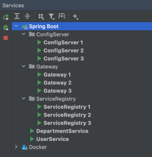

Cloud
-----

This application is using eureka as service registry and spring cloud config for storing service configurations. Spring
Cloud Gateway is used as API Gateway.

The sample further includes 2 simple example services:

- user-service: used to query users that belong to departments
- department-service: holds data for departments

These are held very simple and don't include any logic except that UserService is calling DepartmentService to test
service discovery.

# Overview

## Architecture

The ServiceGateway uses CircuitBreaker if the downstream services are not available. This isn't included in this diagram. The CircuitBreaker implementation is based on resilience4j.

# Startup

The application includes some intellij runners for the Services tab.

The services need to be started in this order:

Infrastructure:

- [ServiceRegistry](infra/service-registry/README.md)
- [ConfigServer](infra/config-server/README.md)
- [Gateway](infra/config-server/README.md)

Everything is registered within the ServiceRegistry (eureka) which is also the only one not dependent on the
ConfigServer. ConfigServer is also using itself for configuration. Config files are places in src/main/resources/config
and follow Spring's profile naming to differentiate which file would be loaded. The application.yml file is used by all.

Services:

- [DepartmentService](service/department-service/README.md)
- [UserService](service/user-service/README.md)

UserService and DepartmentService can be started in any order. But UserService is dependent on DepartmentService and if
there is not DEPARTMENT-SERVICE registered within eureka then you have to wait until the user service eureka client
refreshes its cache before it can discover the instance. The default timeout is 30s.

## Services, Ports & Profiles

The following table shows the services, the port they are using and the Profile the Service is started with. Of course
this setup only makes sense for a local single host deployment and is not meant for production.

| Type    | Service           | ServiceName       | Port | Profile  |
|---------|-------------------|-------------------|------|----------|
| infra   | ServiceRegistry   | ServiceRegistry 1 | 8061 | eureka1  |
| infra   | ServiceRegistry   | ServiceRegistry 2 | 8062 | eureka2  |
| infra   | ServiceRegistry   | ServiceRegistry 3 | 8063 | eureka3  |
| infra   | ConfigServer      | ConfigServer 1    | 8881 | config1  |
| infra   | ConfigServer      | ConfigServer 2    | 8882 | config2  |
| infra   | ConfigServer      | ConfigServer 3    | 8883 | config3  |
| infra   | Gateway           | Gateway 1         | 8181 | gateway1 |
| infra   | Gateway           | Gateway 2         | 8182 | gateway2 |
| infra   | Gateway           | Gateway 3         | 8183 | gateway3 |
| service | DepartmentService | DepartmentService | 8280 |          |
| service | UserService       | UserService       | 8281 |          |

DepartmentService and UserService are not deployed multiple times, but it would be easy to add profiles and different
ports per profile. With these in place the service discovery could choose from the lists as well.

# Eureka

The following image shows an example how the eureka dashboard should look like if all services of this sample are up and
running. (Of course the local ip address will differ from mine.)

# Zipkin

There is also an instance of [zipkin](https://zipkin.io/) running. Zipkin is a distributed tracing system. It helps
gather timing data needed to troubleshoot latency problems in service architectures. The local instance is configured
via docker-compose and can be reached via [http://127.0.0.1:9411/](http://127.0.0.1:9411/).

# Docker-Compose

Compose is used to run Zipkin and databases for Department- and UserService. Instead of spinning up multiple services a
single instance is used with different databases per service. Local port of the database is 5432 and username (
=password) is cloud.